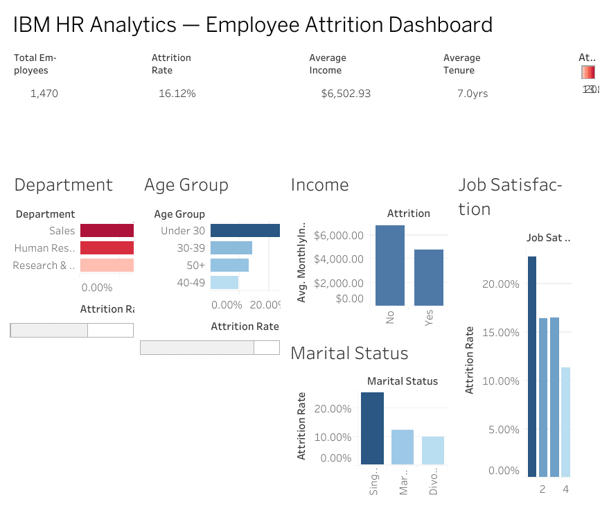

# IBM HR Analytics — Employee Attrition Dashboard (Tableau)

Interactive Tableau dashboard analyzing **1,470 IBM employees** across 6 visual panels — uncovering attrition patterns by department, age group, income level, marital status, and job satisfaction to identify the key drivers of employee turnover.

---

## Dashboard Preview

---

## Key Metrics

| Metric | Value |
|--------|-------|
| Total Employees | **1,470** |
| Overall Attrition Rate | **16.12%** |
| Average Monthly Income | **$6,502.93** |
| Average Tenure | **7.0 years** |
| Dashboard Panels | 6 |

---

## Dashboard Panels

### 1. Attrition by Department
| Department | Attrition Rate |
|------------|----------------|
| Sales | Highest |
| Human Resources | Medium |
| Research & Development | Lowest |

Sales has the highest attrition rate across all departments — indicating potential issues with compensation, targets, or career growth in client-facing roles.

### 2. Attrition by Age Group
| Age Group | Attrition Rate |
|-----------|----------------|
| Under 30 | **Highest (~23%)** |
| 30–39 | Medium |
| 40–49 | Lower |
| 50+ | Lowest |

Younger employees under 30 churn at the highest rate — suggesting early-career dissatisfaction, limited growth opportunities, or competitive external offers for junior talent.

### 3. Attrition by Income Level
Churned employees earn significantly less on average than retained employees — average monthly income for those who left is visibly lower than the $6,502.93 workforce average, confirming **income is a primary driver of attrition**.

### 4. Attrition by Marital Status
| Marital Status | Attrition Rate |
|----------------|----------------|
| Single | **~25%** (Highest) |
| Married | ~12% |
| Divorced | ~10% |

Single employees churn at more than double the rate of married or divorced employees — potentially reflecting lower financial obligations and greater mobility.

### 5. Attrition by Job Satisfaction
Job satisfaction scores of 1–2 (low) correlate with significantly higher attrition rates compared to scores of 3–4 — confirming that **engagement and satisfaction are strong predictors of retention**.

### 6. KPI Summary Cards
Dynamic KPI cards showing total employees, attrition rate, average income, and average tenure — all updating with dashboard filters.

---

## Key Findings

- **16.12% overall attrition** — 237 of 1,470 employees left
- **Sales department** has the highest attrition — top priority for HR intervention
- **Under-30 employees** churn at nearly 2x the rate of employees over 40
- **Single employees** churn at ~25% vs ~10-12% for married/divorced
- **Low job satisfaction (score 1-2)** is a strong leading indicator of departure
- **Income gap** between churned and retained employees is significant — compensation reviews needed

---

## Business Recommendations

**1. Prioritize Sales department retention**
Investigate compensation structure, quota fairness, and career progression paths in Sales — the highest-attrition department.

**2. Invest in early-career programs**
Under-30 employees are the highest churn risk. Mentorship programs, clear promotion paths, and competitive entry-level salaries can reduce early departures.

**3. Income benchmarking**
Employees who leave earn below the workforce average. A compensation benchmarking exercise against market rates could identify and close critical pay gaps.

**4. Engagement surveys for low-satisfaction employees**
Job satisfaction scores of 1–2 strongly predict attrition. Regular pulse surveys and manager check-ins for this segment can catch at-risk employees before they decide to leave.

**5. Retention incentives for single employees**
Single employees churn at 2x the rate — consider flexible work arrangements, career development stipends, or relocation support to increase stickiness.

---

## Tech Stack

`Tableau` `HR Analytics` `Data Visualization` `KPI Dashboard Design` `Attrition Analysis`

---

## Dataset

- **Source:** IBM HR Analytics Employee Attrition & Performance dataset
- **Records:** 1,470 employees
- **Features:** 35 columns — demographics, job role, department, income, satisfaction scores, attrition label
- **Download:** [Kaggle — IBM HR Analytics](https://www.kaggle.com/datasets/pavansubhasht/ibm-hr-analytics-attrition-dataset)

---

## How to View

1. Download the `.twbx` file from this repo *(if available)*
2. Open in **Tableau Public** (free — [download here](https://public.tableau.com/))
3. Or view the dashboard screenshot in the `screenshots/` folder

---

## Project Context

Built as part of my data analytics portfolio to demonstrate:
- HR analytics dashboard design in Tableau
- Multi-panel layout with KPI cards and categorical breakdowns
- Attrition pattern analysis across 5 workforce dimensions
- Translating workforce data into actionable HR recommendations
- Business storytelling with data visualization

---

## Author

**Meshwa Patel** — Data Analyst
[Portfolio](https://meshwa-gif.github.io) · [LinkedIn](https://www.linkedin.com/in/meshwapatel-2b24a8385) · [Email](mailto:meshwapatel2508@gmail.com)
